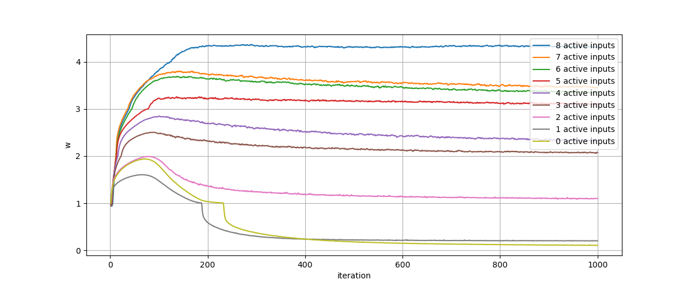
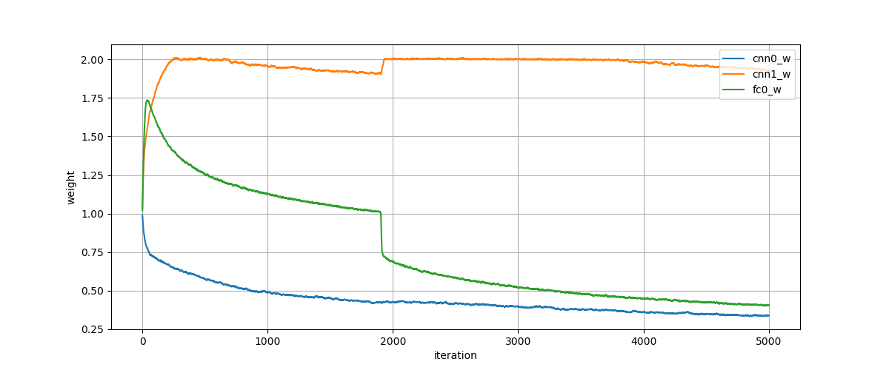

# Going Deeper: Infinite Deep Neural Networks

This repository contains the code for the experiments of the following paper-like document:
[doc/going_deeper.pdf](doc/going_deeper.pdf)

## Summary

The document describes a meta-layer for infinite deep neural networks. It basically wraps a few other layers in a special way that allows the neural network to decide how many sub-layers in the meta-layer should be used. Each sub-layer has its own weights, so the network also decides how many weights should be used. The complete training process may be done with gradient descent-based methods.

Please read [doc/going_deeper.pdf](doc/going_deeper.pdf) for more details.

## Library

The repository contains a small library that allows it to use the described meta-layer. The library is based on [Keras](https://keras.io/). The library is very minimal, so not all network architectures may be created with it. A basic model (the model of the first experiment), may be created like this:

	# Create the model
	n_input_units = 8
	n_internal_units = 24
	model = TDModel()
	model += Input((n_input_units,))
	model += Dense(n_internal_units, activation='relu', trainable=False)
	
	# The described meta-layer
	model += GInftlyLayer(
	
		# The name
	    'd0',
	
		# f_i(x)
	    f_layer=[
	        lambda reg: Dense(n_internal_units),
	        lambda reg: GammaRegularizedBatchNorm(reg=reg, max_free_gamma=0.),
	        lambda reg: Dropout(0.1),
	    ],
	
		# h(x)
		h_step=[
	        lambda reg: Activation('relu')
	    ],
	
		# Regularizers
	    w_regularizer=(c_l2, w_reg),
	    f_regularizer=(c_l2, f_reg)#1e-2)
	)
	model += Dense(1, activation='sigmoid', trainable=False)
	
	
	# Build the model
	model.init(
	    optimizer='adam',
	    loss='binary_crossentropy',
	    metrics=['accuracy']
	)

You may try to test the first experiment to get a better feeling for the interface.

## Experiments

All experiments are more detailed documented in [doc/going_deeper.pdf](doc/going_deeper.pdf).

The first experiment uses 8 binary inputs and calculates the XOR-result of them. The used netwok contains only trainable weights in a `GInftyLayer`-layer. Tests are done with 0-8 active inputs for the XOR-calculation. Inactive inputs are not used for the XOR-calculation and just get random input values.

It can be assumed that a network with more active inputs for the XOR-computation is more complex and, therefore, requires more sub-layers in the `GInftyLayer`-layer. Exactly this can be shown with the given experiment. The `w`-value, which basically contains the amount of sub-layers is higher for more active inputs:

The second experiment is conducted on the MNIST-dataset. The used network architecture contains two convolutional `GInftyLayer`-layers and one fully connected `GInftyLayer`-layer. The test accuracy is up to 99.5 % and it can be seen that the second convolutional `GInftyLayer`-layer is the deepest layer. The first convolutional and the  fully connected `GInftyLayer`-layer have a very low activation. The second convolutional layer has a depth of 2. The weights are visualized on the following plot:

